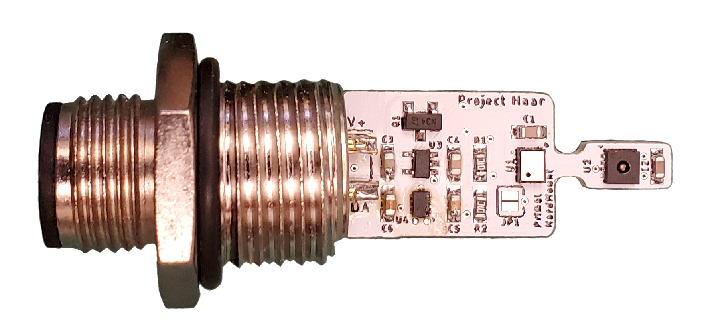
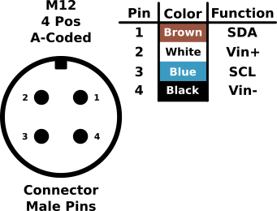

# Project-Haar-Primal
A minimal temp/pressure/RH sensor designed for environmental monitoring. Built off the [Haar](https://github.com/NorthernWidget-Skunkworks/Project-Haar) system, developed by Bobby Schulz at Northern Widget 

# Repo Roadmap
#### [Documents](Documents/) 

General document and image storage for repo and README

#### [Hardware](Hardware/)

Current board files (Eagle), Bill of Materials (BoM), and other design documents

#### [Production](Production/)

Contains the various Gerber and pick and place files required to have the Printed Circuit Boards (PCBs) manufactured or populated 

#### [Software](Software/)

The software associated with the piece of hardware, this is usually diagnostic software used for verifying or investigating the hardware

#### [Mechanical](Mechanical/)

Mechanical design files and assembly documents

<!-- #### [Testing](Testing/)

Scripts and results from the testing process and development process. Contains more detailed information about documented issues among other testing. 
 -->

## Overview
* **Type:** Sensor
* **Interfaces:** I2C
* **Release Version:** v2.0 - 2022/03/17

<!--  -->

## Features
### On-Board
* Selectable Pullups
* Reverse Polarity Protection  

### Interface
* I2C
* M12 circular connector 

<picture>
  <source media="(prefers-color-scheme: dark)" srcset="Documents/Pinout_LIGHT.png">
  
</picture>

## Specifications
* **Voltage - Supply:** 3.3V
* **Voltage - Logic:** 3.3V
* **Input Current (Avg, 1s period): 30.95&mu;A @ 3.3V**
* **Input Current (Avg, 5s period): 107.43&mu;A @ 3.3V**
* **Input Current (Max): 0.45mA @ 3.3V**

#### Sensor
**Temperature** [^1]
* Range: -40 ~ 125°C 
* Accuracy: &plusmn; 0.2°C
* Repeatability: &plusmn; 0.04°C

**Pressure** [^2]
* Range: 300 ~ 1200 hPa  
* Accuracy: &plusmn; 1 hPa
* Repeatability: &plusmn; 0.06 hPa

**Humidity** [^1]
* Range: 0 ~ 100%
* Accuracy: &plusmn; 2%
* Repeatability: 0.08%

[^1]: [SHT31 Datasheet](https://sensirion.com/media/documents/213E6A3B/63A5A569/Datasheet_SHT3x_DIS.pdf)
[^2]: [DPS368 Datasheet](https://www.infineon.com/dgdl/Infineon-DPS368-DS-v01_00-EN.pdf?fileId=5546d46269e1c019016a0c45105d4b40)

## Version History

`v0.0` - Initial primal version with screw terminal

`v0.1` - Initial 'hard mount' version, using M12 connector

`v1.0` - Removed pullup select[^3], added logic level buffer and voltage reg on input

`v1.1` - Moved via away from connector pads to prevent bridging when soldering 

`v2.0` - Fixed issue with address select jumper[^3]

## Jumper Settings 

> [!IMPORTANT]
> Jumper settings valid for version `v2.0` and beyond[^3]

[^3]: See Errata

**Configuration Jumpers**
| Jumper | Purpose | Open | Closed | Default | 
| ------ | ------- | ---------- | ---------- | ----- | 
| `JP1` | I2C Address Select | Base Address&dagger; | Alt Address&Dagger; | Open |

&dagger; SHT31 = `0x44`, DPS368 = `0x76`

&Dagger; SHT31 = `0x44`, DPS368 = `0x77`

## Known Issues/Errata

#### Solder Jumper Stencil

**Version Affected:** All

**Issue:** Depending on the thickness of the solder stencil used for populating the board, the solder jumpers may not bridge when desired. This is due to lack of stencil thickness specification and pad geometry.

**Workaround:** Make a note on the board assembly (if working with a board house) as to which jumpers should be connected (see jumper tables). Otherwise, if assembling manually, check the jumpers are connected, and bridge them using solder wire and a soldering iron if they have failed to jump where desired. 

#### Pullup Jumper

**Version Affected:** `v0.0`

**Issue:** Due to the resistor configuration with the solder jumper, if the jumper is left open, the resistors form a voltage divider which pulls down the I2C rails and causes a variety of bus failures.

**Workaround:** Leave jumper closed on device, this will pull the lines up to the 3.3V rail and prevent the issue 

**Resolution:** Fixed in version `v0.1` and beyond  

#### Address Jumper

**Version Affected:** `v0.1` to `v1.1`

**Issue:** `SDO` pin on DSP368 was erroniously left floating, meaning the DPS368 is continually fixed at the address of `0x76` and will not be effected by the address jumper status

**Workaround:** Leave jumper closed on device, this will hold the SHT31 at the default address as well and keep the address combination consistent 

**Resolution:** Fixed in version `v2.0` and beyond  